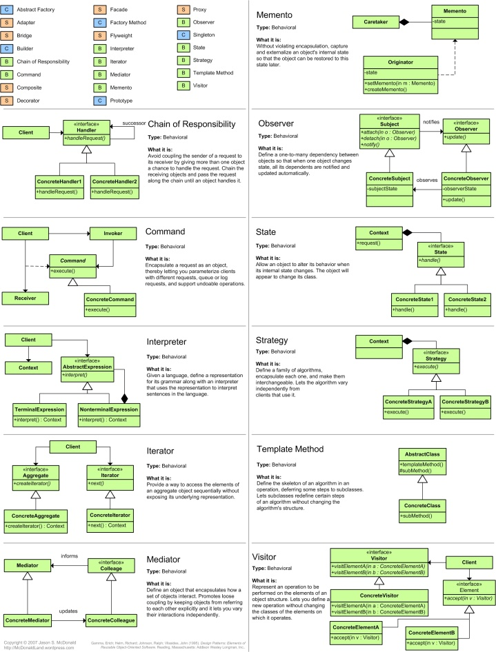

###### Fast Campus
## 프론트엔드 실전 – AngularJS CAMP

[← 레퍼런스로 돌아가기](js-00-reference.md)

### 패턴(Patterns)

넓은 의미의 패턴은 "반복되는 사건이나 객체의 주제로 물건을 만드는 데 사용할 수 있는 틀이나 모형이 될 수 있는 것"을 말한다.
소프트웨어 개발에서는 **일반적인 문제를 해결하는 해결책**을 가리킨다. 바로 복사해서 붙여넣을 수 있는 코드를 말하는 것이 아니라,
*모범적인 관행*, *쓰임새에 맞게 추상화된 원리*, *어떤 범주의 문제 해결을 위한 템플릿* 에 가깝다.

#### 패턴을 사용하는 이유

- 패턴은 검증된 실행 방법으로 쓸데 없이 시간을 낭비하지 않고, 보다 나은 코드를 작성할 수 있도록 도와준다.
- 패턴은 일정 정도의 추상화 단계를 제공한다.
- 패턴은 팀 커뮤니케이션에 도움이 된다. (유지보수, 재사용)

#### 패턴의 종류

- 디자인 패턴 `객체지향 언어(C++, Java 등)에서 사용되는 설계 패턴`
- 코딩 패턴 `자바스크립트 특유의 독특한 패턴`
- 안티 패턴 `문제 해결보다는 오류를 더 많이 읽으킬 소지가 있는 잘못된 접근 방법`

<!-- _1.jpg) -->

---

### 모던 자바스크립트 패턴

1. [Javascript 안티 패턴을 보완하는 방법](js-03-anti-pattern.md)
1. [Javascript 생성자(Constructor)와 리터럴(Literal)](js-04-constructor.md)
1. [Javascript 함수](js-05-function.md)
1. [Javascript 객체 생성 패턴](js-06-create-object-pattern.md)